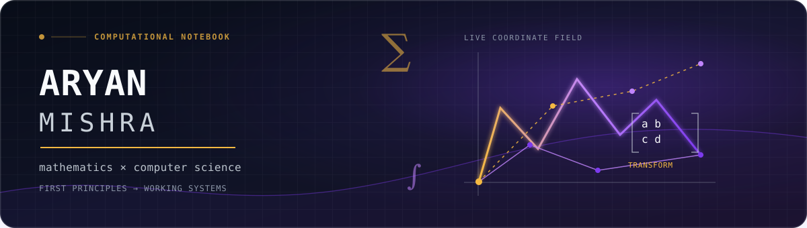
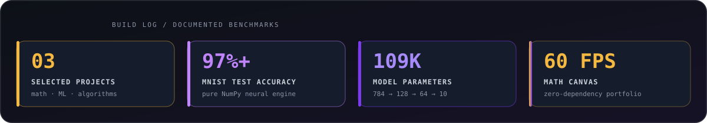

<!-- Profile README for github.com/aryanmsrh -->

  

  
  
  
  

  <code>question</code> &nbsp;→&nbsp; <code>model</code> &nbsp;→&nbsp; <code>algorithm</code> &nbsp;→&nbsp; <code>evidence</code>

## 01 / premise

> Mathematics gives a problem its grammar; programming gives it an executable form.

I’m Aryan — a math-obsessed computer scientist in the making. I build explanations that can run: algorithms, numerical experiments, and systems understood from their primitives before they are abstracted away.

- **Thinking in:** algorithms, linear algebra, optimization, and numerical methods
- **Building with:** Python and NumPy today; actively sharpening C++ for performance-oriented work
- **Default move:** reduce a large idea to first principles, then make the primitives earn their keep

## 02 / selected constructions

<table>
  <tr>
    <td width="50%" valign="top">
      <h3 align="center"><a href="https://github.com/aryanmsrh/neural-engine-numpy">Neural Engine / NumPy</a></h3>
      

      
A neural-network framework written from scratch: vectorized layers, backpropagation, SGD, handwritten-digit inference, and the calculus behind it.

      
<b>784 → 128 → 64 → 10 &nbsp;·&nbsp; 109K parameters &nbsp;·&nbsp; 97%+ MNIST</b>

    </td>
    <td width="50%" valign="top">
      <h3 align="center"><a href="https://aryanmsrh.github.io">Mathematics, in Motion</a></h3>
      

      
An interactive portfolio where linear transformations, determinants, wave mechanics, and vector fields become a live canvas system.

      
<b>60 FPS canvas &nbsp;·&nbsp; ES modules &nbsp;·&nbsp; no build step</b>

    </td>
  </tr>
  <tr>
    <td colspan="2" valign="top">
      <h3 align="center"><a href="https://github.com/aryanmsrh/competitive-programming">Competitive Programming Archive</a></h3>
      
A growing Codeforces and LeetCode laboratory: problem-solving notes, algorithms, and reusable fast-I/O templates for turning constraints into clean solutions.

    </td>
  </tr>
</table>

## 03 / build log

  

Evidence, not vanity counters — figures are drawn from the documented public projects above.

## 04 / next lemma

  <code>curiosity</code> + <code>rigour</code> + <code>iteration</code> &nbsp;⟶&nbsp; <strong>better questions</strong>

  <a href="https://aryanmsrh.github.io">portfolio</a> &nbsp;·&nbsp;
  <a href="https://github.com/aryanmsrh?tab=repositories">repositories</a> &nbsp;·&nbsp;
  <a href="https://github.com/aryanmsrh/neural-engine-numpy">from-scratch neural engine</a>

∎ End of proof — temporary, until the next question.

