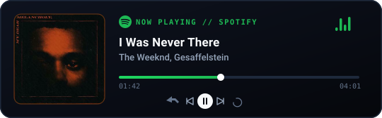

<!-- ================================================================= -->
<!-- ARYAN MISHRA (aryanmsrh) // 2026                                  -->
<!-- Applied Mathematics · Quantitative Finance · Machine Learning     -->
<!-- ================================================================= -->

  

  
  
  

---

### `01 // GITHUB TELEMETRY & STATS`

<table align="center" width="100%">
  <tr>
    <td align="center" width="50%">
      
    </td>
    <td align="center" width="50%">
      
    </td>
  </tr>
</table>

  
  
  

---

### `02 // LANGUAGES`

| Language | Proficiency / Status | Primary Application |
| :--- | :--- | :--- |
| **Python** | `Core / Production` | Vectorized numerical computing, NumPy array math, statistical modelling |
| **C++** | `Actively Learning` | Systems programming, memory management, cache awareness, modern STL (C++20) |
| **LaTeX** | `Daily Tool` | Mathematical manuscripts, proofs, algorithmic problem formulations |
| **Bash / Shell** | `Proficient` | POSIX automation, environment scripting, command-line toolchains |

 

  
  
  
  
  
  

---

### `03 // TERMINAL & RUNTIME`

  

---

### `// NOW PLAYING`

  

---

### `04 // CONTACT & CHANNELS`

| Channel | Destination / Handle |
| :--- | :--- |
| **Interactive Portfolio** | [aryanmsrh.github.io](https://aryanmsrh.github.io) |
| **GitHub Profile** | [@aryanmsrh](https://github.com/aryanmsrh) |
| **Direct Mail** | [aryanmsrh@gmail.com](mailto:aryanmsrh@gmail.com) |

 

---

  <code>dS_t = μ S_t dt + σ S_t dW_t</code> &nbsp;•&nbsp;
  <code>det(A - λI) = 0</code> &nbsp;•&nbsp;
  <code>θ_{t+1} = θ_t - η ∇ L(θ_t)</code>

  Aryan Mishra // 2026

