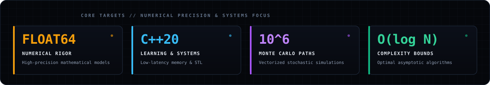

<!-- ================================================================= -->
<!-- ARYAN MISHRA (aryanmsrh) // OBSIDIAN MINIMAL                      -->
<!-- Applied Mathematics · Quantitative Finance · Machine Learning     -->
<!-- ================================================================= -->

<p align="center">
  
</p>

<p align="center">
  <a href="https://aryanmsrh.github.io"></a>
  <a href="https://github.com/aryanmsrh"></a>
  <a href="mailto:aryanmsrh@gmail.com"></a>
</p>

<div align="center">

```
OPERATOR  :: Aryan Mishra (@aryanmsrh)
DOMAINS   :: Applied Mathematics · Quantitative Finance · Machine Learning
RUNTIMES  :: Python 3.11+ (Numerical/Vectorized) · C++20 (Actively Learning / Systems)
STATUS    :: Formulate from first principles; execute with computational rigor.
```

</div>

---

### `// ON REPEAT`

<p align="center">
  <a href="https://open.spotify.com/track/1cKHxgncyUbxYqZ5yv6V1b" target="_blank" rel="noopener noreferrer">
    
  </a>
</p>

---

### `01 // LANGUAGES`

<div align="center">

| Language | Proficiency / Status | Primary Application |
| :--- | :--- | :--- |
| **Python** | `Core / Production` | Vectorized numerical computing, NumPy array math, statistical modelling |
| **C++** | `Actively Learning` | Systems programming, memory management, cache awareness, modern STL (C++20) |
| **LaTeX** | `Daily Tool` | Mathematical manuscripts, proofs, algorithmic problem formulations |
| **Bash / Shell** | `Proficient` | POSIX automation, environment scripting, command-line toolchains |
| **SQL** | `Working Knowledge` | Relational querying, dataset manipulation, aggregations |

<br>

<p align="center">
  
  
  
  
  
  
</p>

</div>

---

### `02 // TECHNICAL SKILLS & DOMAIN MATRIX`

<div align="center">

| Domain | Core Areas of Focus &amp; Methodologies |
| :--- | :--- |
| **Mathematical Modelling** | Linear algebra, spectral decompositions (Eigenvalues/SVD), numerical ODE/PDE solvers, dynamical systems, multivariable calculus. |
| **Quantitative Finance** | Stochastic calculus (Ito's Lemma), Geometric Brownian Motion (GBM), Monte Carlo path simulation, risk metrics (VaR/CVaR), volatility modeling. |
| **Machine Learning** | Optimization manifolds, gradient descent variants, loss landscape geometry, matrix calculus for backpropagation, vectorized array primitives. |
| **Algorithms &amp; Systems** | Computational complexity analysis $O(1) \dots O(N \log N)$, fast I/O routines, cache-conscious data structures. |

</div>

---

### `03 // COMPUTATIONAL TARGETS`

<p align="center">
  
</p>

---

### `04 // GITHUB TELEMETRY & STATS`

<table align="center" width="100%">
  <tr>
    <td align="center" width="50%">
      
    </td>
    <td align="center" width="50%">
      
    </td>
  </tr>
  <tr>
    <td colspan="2" align="center">
      
    </td>
  </tr>
</table>

---

### `05 // CONTACT & CHANNELS`

<div align="center">

| Channel | Destination / Handle |
| :--- | :--- |
| **Interactive Portfolio** | [aryanmsrh.github.io](https://aryanmsrh.github.io) |
| **GitHub Profile** | [@aryanmsrh](https://github.com/aryanmsrh) |
| **Direct Mail** | [aryanmsrh@gmail.com](mailto:aryanmsrh@gmail.com) |
| **Spotify** | [The Weeknd — I Was Never There](https://open.spotify.com/track/1cKHxgncyUbxYqZ5yv6V1b) |

<br>

<a href="https://aryanmsrh.github.io"></a>
<a href="mailto:aryanmsrh@gmail.com"></a>

</div>

---

<p align="center">
  <code>dS_t = μ S_t dt + σ S_t dW_t</code> &nbsp;•&nbsp;
  <code>det(A - λI) = 0</code> &nbsp;•&nbsp;
  <code>θ_{t+1} = θ_t - η ∇ L(θ_t)</code>
</p>

<p align="center">
  <sub>Aryan Mishra // High-Tech Minimalist // Obsidian Theme</sub>
</p>
